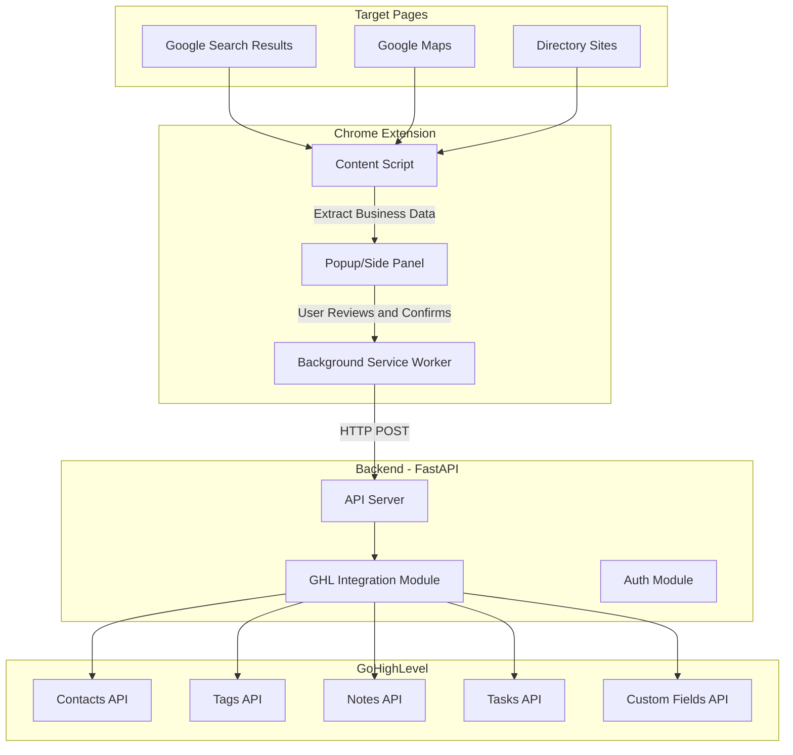
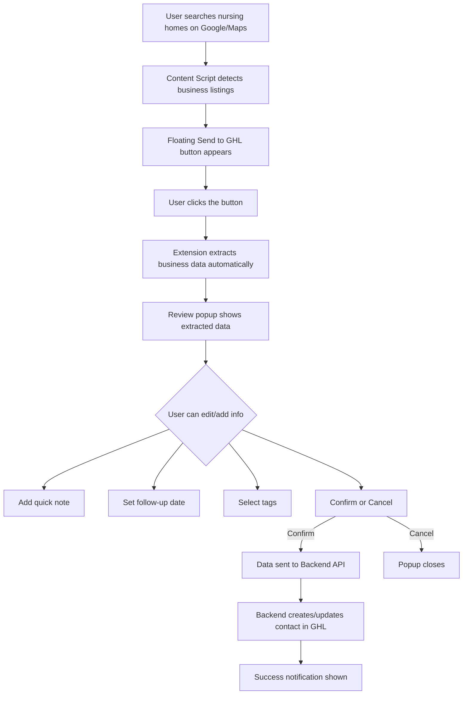
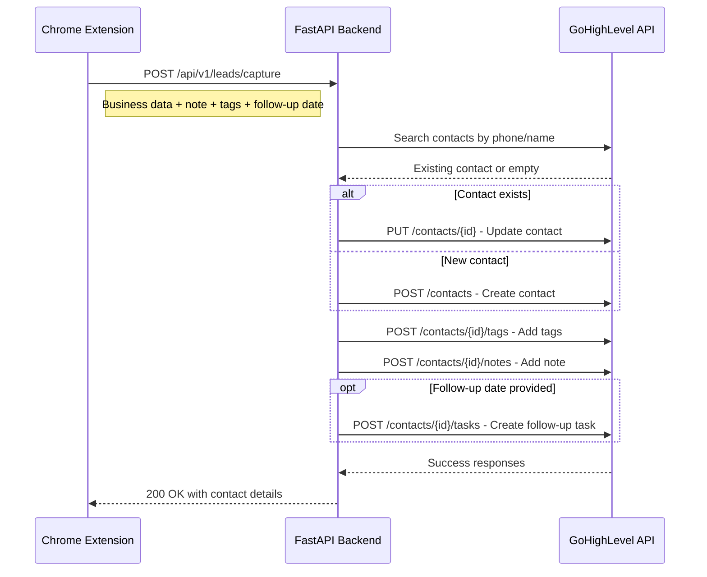
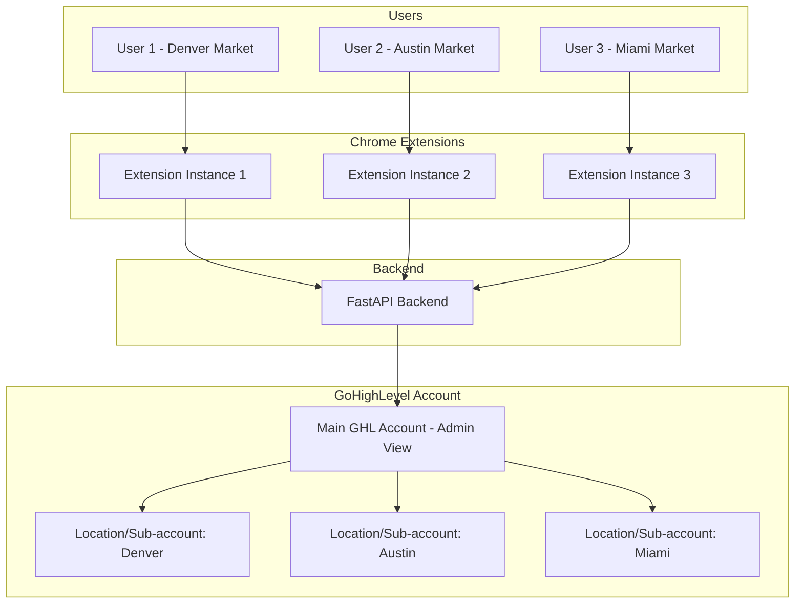

# Phase 1 Technical Plan: Click-to-Capture Chrome Extension + GHL Integration

## 1. Project Overview

**Goal:** Build a Chrome Extension that allows the user to capture business information from Google Search, Google Maps, and directory sites with one click, then automatically create/update contacts in GoHighLevel CRM.

**Client:** Mai Bui  
**Budget:** $300  
**Deadline:** Monday, Mar 30, 2026  
**Milestone:** Lead capturing feature

---

## 2. System Architecture



---

## 3. User Flow



---

## 4. Chrome Extension Design

### 4.1 Manifest V3 Structure

The extension will use **Manifest V3** - the latest Chrome Extension standard.

**Key components:**
- **Content Scripts** - Injected into Google Search, Maps, and directory pages to detect and extract business data
- **Popup** - Review panel for captured data before sending to GHL
- **Background Service Worker** - Handles API communication with backend
- **Options Page** - Configuration for GHL API key, location ID, default tags

### 4.2 Data Extraction Strategy

| Source Page | Detection Method | Extractable Fields |
|---|---|---|
| Google Search | CSS selectors for business knowledge panel and local pack | Name, Phone, Website, Address, Rating |
| Google Maps | CSS selectors for place details panel | Name, Phone, Website, Address, Rating, Category |
| Directory Sites | Generic extraction using Schema.org markup + common patterns | Name, Phone, Website, Address |

### 4.3 Extracted Data Schema

```json
{
  "businessName": "Sunrise Senior Living",
  "phone": "+1-555-123-4567",
  "website": "https://sunriseseniorliving.com",
  "address": "123 Care Lane, Denver, CO 80201",
  "city": "Denver",
  "state": "CO",
  "sourceUrl": "https://www.google.com/maps/place/...",
  "sourceType": "google_maps",
  "rating": "4.5",
  "category": "Nursing Home",
  "capturedAt": "2026-03-17T10:30:00Z",
  "note": "User added quick note here",
  "followUpDate": "2026-03-20",
  "tags": ["Nursing Home", "Denver", "New Lead"]
}
```

### 4.4 Extension UI Components

1. **Floating Action Button** - Small circular button that appears near business listings
2. **Review Popup** - Modal with:
   - Pre-filled business fields (editable)
   - Quick note text area
   - Follow-up date picker
   - Tag selector (predefined + custom)
   - Save / Cancel buttons
3. **Success/Error Toast** - Brief notification after save
4. **Options Page** - Settings for API endpoint, GHL credentials, default tags

---

## 5. Backend API Design - FastAPI

### 5.1 API Endpoints

| Method | Endpoint | Description |
|---|---|---|
| POST | `/api/v1/auth/login` | Authenticate user and return JWT token |
| GET | `/api/v1/auth/me` | Get current user info |
| POST | `/api/v1/leads/capture` | Capture new lead from extension |
| GET | `/api/v1/leads` | List recent captured leads |
| GET | `/api/v1/leads/{id}` | Get specific lead details |
| POST | `/api/v1/leads/{id}/duplicate-check` | Check for duplicate in GHL |
| GET | `/api/v1/tags` | Get available tags from GHL |
| GET | `/api/v1/health` | Health check endpoint |

### 5.2 Lead Capture Flow



### 5.3 Backend Project Structure

```
backend/
├── app/
│   ├── __init__.py
│   ├── main.py                 # FastAPI app entry point
│   ├── config.py               # Settings and environment variables
│   ├── dependencies.py         # Dependency injection
│   ├── api/
│   │   ├── __init__.py
│   │   ├── v1/
│   │   │   ├── __init__.py
│   │   │   ├── router.py       # Main API router
│   │   │   ├── leads.py        # Lead capture endpoints
│   │   │   ├── auth.py         # Authentication endpoints
│   │   │   └── tags.py         # Tags endpoints
│   ├── models/
│   │   ├── __init__.py
│   │   ├── lead.py             # Lead data models (Pydantic)
│   │   └── auth.py             # Auth models
│   ├── services/
│   │   ├── __init__.py
│   │   ├── ghl_service.py      # GoHighLevel API integration
│   │   ├── lead_service.py     # Lead processing business logic
│   │   └── auth_service.py     # Authentication logic
│   └── utils/
│       ├── __init__.py
│       └── exceptions.py       # Custom exception handlers
├── tests/
│   ├── __init__.py
│   ├── test_leads.py
│   └── test_ghl_service.py
├── .env.example
├── requirements.txt
├── Dockerfile
└── README.md
```

---

## 6. GoHighLevel API Integration

### 6.1 Required GHL APIs

| API | Endpoint | Purpose |
|---|---|---|
| Contacts | `POST /contacts/` | Create new contact |
| Contacts | `PUT /contacts/{id}` | Update existing contact |
| Contacts | `GET /contacts/search` | Search/deduplicate contacts |
| Tags | `POST /contacts/{id}/tags` | Add tags to contact |
| Notes | `POST /contacts/{id}/notes` | Add notes to contact |
| Tasks | `POST /contacts/{id}/tasks` | Create follow-up tasks |
| Custom Fields | `GET /locations/{id}/customFields` | Get custom fields |

### 6.2 GHL Contact Mapping

| Extension Field | GHL Contact Field | Notes |
|---|---|---|
| businessName | companyName + firstName | Also set as contact name |
| phone | phone | Primary phone |
| website | website | Business website |
| address | address1 | Full street address |
| city | city | City name |
| state | state | State code |
| sourceUrl | customField.source_url | Custom field for tracking |
| sourceType | customField.source_type | google_search, google_maps, directory |
| category | customField.business_category | e.g. Nursing Home |

### 6.3 Authentication

- Use **GHL API Key** (v2) with Location scope
- API Key stored securely in backend `.env`
- Extension communicates with backend only (never directly with GHL)

---

## 7. Chrome Extension Project Structure

```
extension/
├── manifest.json               # Manifest V3 configuration
├── icons/
│   ├── icon16.png
│   ├── icon32.png
│   ├── icon48.png
│   └── icon128.png
├── content/
│   ├── content.js              # Main content script
│   ├── content.css             # Styles for injected UI
│   ├── extractors/
│   │   ├── google-search.js    # Google Search extractor
│   │   ├── google-maps.js      # Google Maps extractor
│   │   └── generic.js          # Generic directory extractor
│   └── components/
│       ├── floating-button.js  # Floating capture button
│       └── review-popup.js     # Data review popup
├── popup/
│   ├── popup.html              # Extension popup UI
│   ├── popup.js                # Popup logic
│   └── popup.css               # Popup styles
├── options/
│   ├── options.html            # Options/settings page
│   ├── options.js              # Options logic
│   └── options.css             # Options styles
├── background/
│   └── service-worker.js       # Background service worker
├── utils/
│   ├── api.js                  # Backend API client
│   ├── storage.js              # Chrome storage helpers
│   └── constants.js            # Shared constants
└── assets/
    └── styles/
        └── common.css          # Shared styles
```

---

## 8. Multi-User Support Design

Since the client mentioned they will have multiple users working different markets:



**Phase 1 Implementation:**
- Extension Options page includes a location/market selector
- Each captured lead is tagged with the user's assigned market
- Backend routes data to the correct GHL location
- Admin can see all leads across all markets in GHL

---

## 9. Deployment Strategy

### Backend
- **Host:** Railway or Render (free tier for development, paid for production)
- **Domain:** Custom subdomain (e.g., `api.ghl-assistant.com`)
- **SSL:** Auto-provisioned via hosting platform
- **Environment:** Python 3.11+, FastAPI, uvicorn

### Chrome Extension
- **Development:** Load unpacked in Chrome for testing
- **Distribution:** 
  - Option A: Chrome Web Store (public or unlisted)
  - Option B: Direct `.crx` file distribution (simpler for small team)

---

## 10. Implementation Steps - Ordered

### Step 1: Project Setup
- Initialize Git repository
- Set up backend project structure (FastAPI)
- Set up Chrome extension project structure (Manifest V3)
- Configure environment variables

### Step 2: GHL Integration Service
- Implement GHL API client with authentication
- Create contact CRUD operations
- Implement tag management
- Implement note creation
- Implement task creation for follow-ups
- Implement contact search/deduplication

### Step 3: Backend API Endpoints
- Create FastAPI app with CORS configuration
- Implement `/api/v1/leads/capture` endpoint
- Implement `/api/v1/leads` list endpoint
- Implement `/api/v1/tags` endpoint
- Add error handling and validation
- Add health check endpoint

### Step 4: Chrome Extension - Core
- Create Manifest V3 configuration
- Build content scripts for page detection
- Build data extractors for Google Search
- Build data extractors for Google Maps
- Build generic extractor for directory sites

### Step 5: Chrome Extension - UI
- Build floating action button component
- Build review popup with form fields
- Build tag selector component
- Build follow-up date picker
- Build success/error notification toasts
- Style all components

### Step 6: Chrome Extension - Integration
- Implement background service worker
- Connect extension to backend API
- Implement options page for configuration
- Handle authentication flow
- Implement Chrome storage for settings

### Step 7: Testing
- Test data extraction on Google Search
- Test data extraction on Google Maps
- Test on common directory sites client uses
- Test GHL contact creation/update
- Test tag assignment
- Test note creation
- Test task creation for follow-ups
- Test duplicate detection
- Cross-browser testing (Chrome)

### Step 8: Deployment
- Deploy backend to hosting platform
- Package Chrome extension
- Write setup instructions for client
- Create demo video showing the workflow

---

## 11. Environment Variables

### Backend `.env`
```
GHL_API_KEY=your_ghl_api_key
GHL_LOCATION_ID=your_location_id
GHL_BASE_URL=https://services.leadconnectorhq.com
API_SECRET_KEY=your_jwt_secret
ALLOWED_ORIGINS=chrome-extension://extension_id
```

### Extension Options (stored in Chrome Storage)
```
backendUrl: https://api.ghl-assistant.com
defaultTags: ["New Lead"]
defaultMarket: ""
```

---

## 12. What We Need From Client Before Starting

1. **GHL API Key** - From Settings > Business Profile > API Keys
2. **GHL Location ID** - The sub-account/location to push contacts to
3. **Example pages** - 2-3 URLs of pages they typically search on
4. **Existing tags** - Any tags already set up in GHL they want to reuse
5. **Custom fields** - Any custom fields already created in GHL
6. **Access to GHL account** - For testing the integration

---

## 13. Risk Mitigation

| Risk | Impact | Mitigation |
|---|---|---|
| Google changes page structure | Extension stops extracting data | Use robust selectors, add fallback generic extractor |
| GHL API rate limits | Data not saved | Implement retry logic with exponential backoff |
| GHL API changes | Integration breaks | Pin API version, monitor GHL changelog |
| Extension review delays on Chrome Web Store | Delayed delivery | Distribute via direct install initially |
| Client GHL account has custom setup | Mapping issues | Get access early, test with real account |
