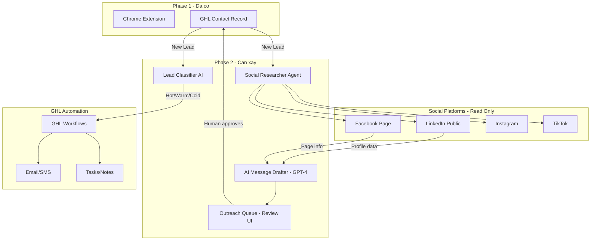

# Phân tích Phase 2 — Tiếng Việt

**Ngày:** 2026-03-26  
**Client:** Mai Bui  
**Mục tiêu:** AI hỗ trợ Social Media outreach + Lead automation trong GHL

---

## 🎯 Client muốn gì?

Phase 1 đã xong: **Chrome Extension capture lead từ Google/Maps/Yelp vào GHL bằng 1 click**.

Phase 2: Client muốn **AI làm thêm nhiều việc hơn** để tiết kiệm thời gian — cụ thể là tự động hóa social media và tự động chạy sequence cho Warm/Hot leads.

---

## 📌 Scenario 1 — Tự động hóa Social Media

**Client hỏi:** AI có thể vào LinkedIn, Facebook, Instagram, TikTok để like, comment, kết nối, nhắn tin thay không?

### Phân tích kỹ thuật

Có 2 cách tiếp cận:

**Cách 1: FULLY AUTOMATED (Bot hoàn toàn)**
- AI tự like/comment/send message không cần người click
- Kỹ thuật: Selenium, Puppeteer, browser automation
- RỦI RO CAO: LinkedIn, Facebook đều có anti-bot detection
- Hậu quả: BAN account vĩnh viễn
- **KHÔNG NÊN LÀM**

**Cách 2: SEMI-AUTOMATED (AI chuẩn bị, người click)**
- AI nghiên cứu profile, soạn message sẵn
- Người chỉ cần review và click Send
- AN TOÀN: Không vi phạm ToS của bất kỳ platform nào
- Tiết kiệm 80% thời gian
- **NÊN LÀM**

### Những gì AI CÓ THỂ làm an toàn

| Tác vụ | Cách AI làm | Kết quả lưu vào GHL |
|---|---|---|
| Tìm Facebook page | Tìm kiếm qua Google + FB API công khai | Link Facebook |
| Tìm LinkedIn company page | Tìm qua LinkedIn public search | Link LinkedIn |
| Tìm Instagram, TikTok | Tìm qua Google/API công khai | Link IG + TikTok |
| Soạn message LinkedIn | AI đọc profile → GPT-4 soạn personalized message | Draft message |
| Soạn email từ LinkedIn | AI đọc profile → soạn email cá nhân hóa | Draft email trong GHL |

---

## 📌 Scenario 2 — AI Agent cho Warm/Hot Lead Sequences

**Client hỏi:** AI có thể tự động follow một quy trình cho Warm/Hot leads không?

### Flow hiện tại (manual)
```
Lead vào GHL 
→ Nhân viên xem thủ công 
→ Quyết định follow-up 
→ Gửi email/call
```

### Flow Phase 2 (AI-powered)
```
Lead vào GHL
  → AI phân tích: website, industry, location, source
  → AI classify: Cold / Warm / Hot
  → Trigger đúng sequence:
      HOT:  Email ngay + Task "Call within 2 hours" + SMS
      WARM: Email sequence 3 ngày + reminder task
      COLD: Nurture sequence dài hạn
  → AI soạn nội dung email/SMS personalized
  → Auto-send hoặc queue để bạn approve
```

### Tích hợp với GHL

GHL đã có **Workflows** (automation engine) sẵn. AI sẽ:
1. Trigger đúng GHL Workflow dựa trên classification
2. Điền nội dung personalized vào template email/SMS
3. Ghi note tự động vào contact record

---

## 📌 Bonus — LinkedIn Research → Draft Email

**Client hỏi:** Nếu tìm thấy contact trên LinkedIn, AI có soạn email dựa trên đó không?

### Flow
```
1. Lead có trong GHL (tên công ty, website)
2. AI tìm LinkedIn profile của owner/manager
3. AI đọc: title, company size, industry, recent activity, bio
4. GPT-4 soạn email cá nhân hóa:
   - Đề cập đúng tên, chức vụ
   - Liên quan đến industry của họ
   - Tone phù hợp với LinkedIn profile
5. Email draft hiện trong GHL → bạn review → click Send
```

### Ví dụ email được AI soạn
> "Hi John, I noticed you've been leading ABC Nursing Home in Anaheim for the past 5 years — impressive growth! I work with senior care facilities in your area to help them [value proposition]..."

---

## 🏗️ Kiến trúc kỹ thuật Phase 2



---

## 💰 Gợi ý chia Phase 2

Để tránh scope quá lớn, chia thành 2 phần nhỏ:

### Phase 2A — Quick Wins (ưu tiên làm trước)
- ✅ AI auto-find social profiles → lưu link vào GHL contact record
- ✅ AI soạn draft message cho LinkedIn/Email từ profile data
- ✅ Lead classifier (Hot/Warm/Cold) tự động trong GHL

### Phase 2B — Advanced
- ✅ Semi-auto outreach queue UI (review + approve + send)
- ✅ AI agent chạy full Warm/Hot sequence tự động
- ✅ LinkedIn scraper nâng cao (đọc recent posts, connections)

---

## ⚠️ Điểm quan trọng cần nói thẳng với client

### 1. Không nên làm bot fully automated social
LinkedIn đặc biệt rất nhạy, có hệ thống phát hiện bot cực kỳ tốt (CAPTCHA, device fingerprinting, behavior analysis). Bị ban là mất account — **không khôi phục được**.

### 2. Semi-automated là đủ và tốt hơn
Thực tế tiết kiệm 80% thời gian mà hoàn toàn an toàn. Nội dung AI soạn vẫn trông như người viết.

### 3. GHL đã có Workflows sẵn
Không cần build từ đầu. Chỉ cần thêm AI layer (classifier + drafter) lên trên infrastructure GHL đã có.

### 4. OpenAI GPT-4 đã tích hợp trong Phase 1
Infrastructure AI đã có. Phase 2 chỉ cần extend thêm use cases mới. Chi phí API thêm nhưng không đáng kể.

---

## 📋 Feature Matrix đầy đủ

| Feature | Feasibility | Risk | Priority | Ghi chú |
|---|---|---|---|---|
| Auto-find social profiles | ✅ Cao | Thấp | P1 | Safe, dùng public data |
| Save social links to GHL | ✅ Cao | Thấp | P1 | GHL API đã có trong Phase 1 |
| AI soạn outreach messages | ✅ Cao | Thấp | P1 | GPT-4 đã tích hợp |
| Semi-auto social actions | ✅ Cao | Thấp | P1 | Human-in-the-loop |
| AI agent Warm/Hot sequences | ✅ Cao | Thấp | P1 | GHL Workflows làm backbone |
| LinkedIn → draft email | ✅ Cao | Thấp | P1 | Chỉ đọc public profile |
| Fully automated social (no click) | ⚠️ Có thể | Cao - ToS ban | P3 | Không khuyến nghị |

---

## 🔄 Next Steps đề xuất

1. **Discovery call** — align với client về priority: feature nào tiết kiệm nhiều thời gian nhất?
2. **Scope Phase 2A** — chọn 3-4 features P1 để bắt đầu
3. **Pricing proposal** — dựa trên scoped features
4. **Implementation** — extend Phase 1 backend + new AI agent module
