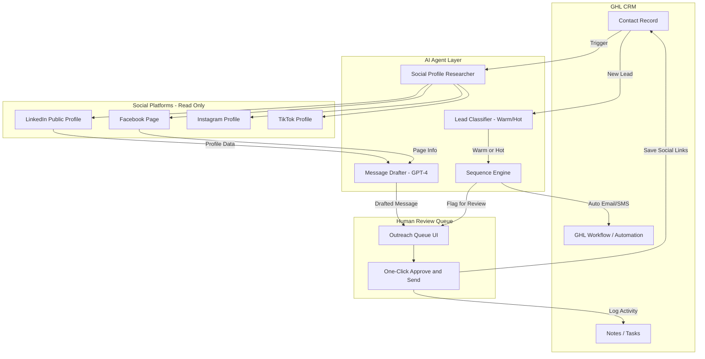

# Phase 2 — Client Response & Scope Draft

**Date:** 2026-03-26  
**Client:** Mai Bui  
**Context:** Phase 1 complete (Chrome Extension + GHL Lead Capture). Client wants to explore Phase 2 with AI + Social Media automation.

---

## Client's Scenarios (from Google Doc)

### Scenario 1 — Social Media Automation
> LinkedIn, Facebook, Instagram, TikTok — can AI like, comment, love, connect, send messages on behalf? Or semi-auto (AI prepares, human clicks)?

### Scenario 2 — AI Agent for Warm/Hot Lead Sequences
> AI agent follows a process/sequence for Warm or Hot leads in GHL.

### Bonus Question
> If contact found on LinkedIn, can AI draft a personalized email based on their profile?

---

## Proposed Reply to Client

---

Hey [Client],

Thanks for sharing the Phase 2 vision — this is exciting and very doable! Let me break down each scenario for you:

---

### 🔷 Scenario 1 — Social Media Automation (LinkedIn, Facebook, Instagram, TikTok)

**What AI CAN do safely (recommended):**
- ✅ Auto-research a contact's social profiles — given a business name or website, AI finds their LinkedIn, Facebook, Instagram, TikTok pages, then saves those links directly into the GHL contact record
- ✅ Draft personalized outreach messages for each platform — based on their business info, industry, location — ready for you to review and send with one click
- ✅ Suggest best platform to reach out on, based on where they're most active

**What requires caution ⚠️:**
- ❌ Fully automated liking, commenting, connecting, and messaging **without your click** is against LinkedIn, Facebook, Instagram, and TikTok Terms of Service — accounts can get banned
- ✅ **Semi-automated approach (recommended):** AI prepares everything (drafted message, target profile), and you just click **Send / Like / Connect** — this looks human, avoids bans, and still saves you 80% of the time

> **Our recommendation:** Build a "Social Outreach Queue" inside GHL — AI researches and drafts, you approve and click. Best of both worlds.

---

### 🔷 Scenario 2 — AI Agent for Warm/Hot Lead Sequences

**Yes, absolutely!** This is exactly what AI agents are great at.

We can build an AI agent that follows a custom sequence for Warm or Hot leads:

1. Lead comes in → AI classifies as Warm or Hot based on criteria you define
2. AI triggers the right sequence (different follow-up cadence for Warm vs Hot)
3. AI drafts personalized emails/SMS based on their business info
4. AI can auto-send low-risk touchpoints (initial email, SMS) and flag high-value ones for your manual review

---

### 🔷 Bonus — LinkedIn Research → Draft Email

**Yes, this is very powerful and safe:**
- AI finds the contact on LinkedIn
- Reads their profile (title, company, industry, recent posts if public)
- Drafts a personalized email based on that LinkedIn intel
- Email appears in GHL, ready for you to review and send

This works great and doesn't violate any TOS because we're reading public info and drafting — you hit send.

---

## Proposed Phase 2 Feature Matrix

| Feature | Feasibility | Risk | Priority |
|---|---|---|---|
| Auto-find social profiles from contact info | ✅ High | Low | P1 |
| Save social links to GHL contact record | ✅ High | Low | P1 |
| AI draft outreach messages per platform | ✅ High | Low | P1 |
| Semi-auto social actions (you click to send) | ✅ High | Low | P1 |
| AI agent for Warm/Hot lead sequences in GHL | ✅ High | Low | P1 |
| LinkedIn research → draft personalized email | ✅ High | Low | P1 |
| Fully automated social actions (no click) | ⚠️ Possible | High (ToS ban) | P3 |

---

## Technical Architecture Ideas (Phase 2)

---

## Recommended Next Steps

1. **Discovery call** — align on which features save the most time
2. **Scope Phase 2A** — start with highest-value, lowest-risk features
3. **Pricing proposal** — based on scoped features

---

## Notes

- All social automation should follow platform ToS to protect client accounts
- LinkedIn scraping: use public profiles only, no login automation
- GHL Workflows can be used as the backbone for lead sequences
- AI drafting via OpenAI GPT-4 (already integrated in Phase 1 backend)
