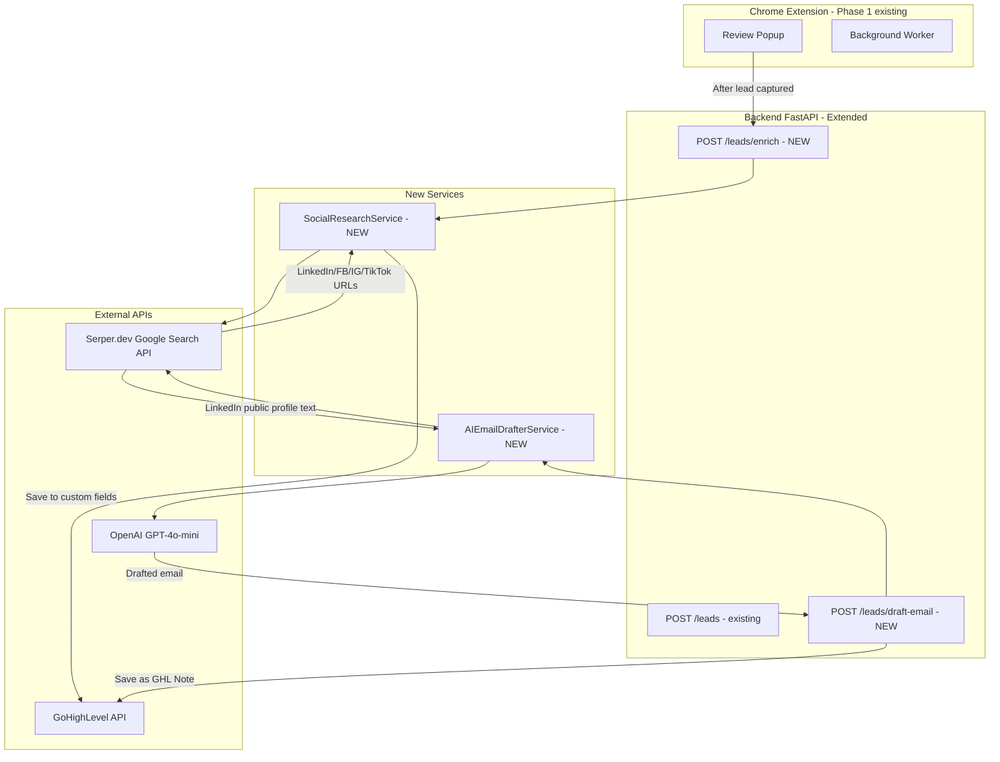
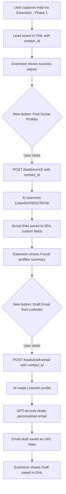

# Phase 2A Technical Plan: AI Social Profile Finder + LinkedIn Email Drafter

**Date:** 2026-03-26  
**Client:** Mai Bui  
**Scope:** Phase 2A — Quick wins, low risk  
**Builds on:** Phase 1 (Chrome Extension + GHL Integration — FastAPI backend)

---

## 1. Mục tiêu Phase 2A

Sau khi lead đã được capture vào GHL (Phase 1), Phase 2A giúp:

1. **AI tự động tìm social profiles** (LinkedIn, Facebook, Instagram, TikTok) của business từ tên + website → lưu vào GHL contact record
2. **AI soạn personalized email** dựa trên LinkedIn profile của contact → hiện trong GHL để client review và send

---

## 2. Kiến trúc tổng thể



---

## 3. User Flow



---

## 4. Backend Changes

### 4.1 New API Endpoints

#### `POST /api/v1/leads/enrich`

```
Request:
{
  "contact_id": "ghl_contact_id",
  "business_name": "Sunrise Senior Living",
  "website": "https://sunriseseniorliving.com",
  "city": "Denver",
  "state": "CO"
}

Response:
{
  "success": true,
  "contact_id": "...",
  "profiles_found": {
    "linkedin": "https://linkedin.com/company/sunrise-senior-living",
    "facebook": "https://facebook.com/sunriseseniorliving",
    "instagram": "https://instagram.com/sunriseseniorliving",
    "tiktok": null
  },
  "saved_to_ghl": true
}
```

#### `POST /api/v1/leads/draft-email`

```
Request:
{
  "contact_id": "ghl_contact_id",
  "business_name": "Sunrise Senior Living",
  "linkedin_url": "https://linkedin.com/company/sunrise-senior-living",
  "sender_name": "Mai Bui",
  "sender_company": "Your Company",
  "pitch": "We help senior care facilities with visitor management"
}

Response:
{
  "success": true,
  "contact_id": "...",
  "draft_email": {
    "subject": "Helping Sunrise Senior Living with...",
    "body": "Hi [First Name],\n\nI noticed that Sunrise Senior Living..."
  },
  "saved_as_note": true,
  "note_id": "..."
}
```

### 4.2 New Services

#### `backend/app/services/social_research_service.py`

```
Responsibilities:
- search_social_profiles(business_name, website, city, state)
  → Calls Serper.dev API with queries like:
    "Sunrise Senior Living Denver LinkedIn"
    "Sunrise Senior Living Denver Facebook page"
    "Sunrise Senior Living Instagram"
  → Parse results to extract correct profile URLs
  → Filter/validate URLs (domain check: linkedin.com, facebook.com, instagram.com, tiktok.com)
  → Return dict of platform → URL

- save_profiles_to_ghl(contact_id, profiles)
  → Uses GHL custom fields to store social URLs
  → Calls ghl_service.update_contact() with custom field values
```

#### `backend/app/services/ai_email_drafter_service.py`

```
Responsibilities:
- fetch_linkedin_profile_text(linkedin_url)
  → Serper.dev search to get public LinkedIn profile snippet
  → Extract: name, title, company, industry, bio text

- draft_email(profile_data, sender_info, pitch)
  → Calls OpenAI GPT-4o-mini with structured prompt
  → Returns subject + body

- Prompt template:
  "You are a professional sales rep. Based on this LinkedIn profile:
   Name: {name}, Title: {title}, Company: {company}, Industry: {industry}
   Bio: {bio}
   
   Draft a short, personalized cold outreach email (under 150 words) from {sender_name}
   at {sender_company}. Our value proposition: {pitch}.
   
   Rules:
   - Reference something specific from their profile
   - Sound human, not salesy
   - Clear call to action
   
   Return JSON: {subject: '...', body: '...'}"
```

### 4.3 New Model: `backend/app/models/enrich.py`

```python
class EnrichRequest(BaseModel):
    contact_id: str
    business_name: str
    website: Optional[str]
    city: Optional[str]
    state: Optional[str]

class EnrichResponse(BaseModel):
    success: bool
    contact_id: str
    profiles_found: Dict[str, Optional[str]]  # platform -> url
    saved_to_ghl: bool

class DraftEmailRequest(BaseModel):
    contact_id: str
    business_name: str
    linkedin_url: Optional[str]
    sender_name: str
    sender_company: str
    pitch: str

class DraftEmailResponse(BaseModel):
    success: bool
    contact_id: str
    draft_email: Dict[str, str]  # subject, body
    saved_as_note: bool
    note_id: Optional[str]
```

### 4.4 GHL Custom Fields Setup

Client cần tạo thủ công 4 custom fields trong GHL UI (hoặc ta gọi API tạo tự động):

| Field Name | Key | Type |
|---|---|---|
| LinkedIn URL | `linkedin_url` | TEXT |
| Facebook URL | `facebook_url` | TEXT |
| Instagram URL | `instagram_url` | TEXT |
| TikTok URL | `tiktok_url` | TEXT |

Sau đó ta dùng GHL Custom Fields API để update contact record.

### 4.5 Config additions (`backend/app/config.py`)

```python
# AI & Search APIs
openai_api_key: str = ""
serper_api_key: str = ""
openai_model: str = "gpt-4o-mini"

# Email drafter defaults
default_sender_name: str = ""
default_sender_company: str = ""
default_pitch: str = ""
```

### 4.6 New dependencies (`backend/requirements.txt`)

```
openai==1.30.0
# Note: Serper.dev uses plain httpx (already in requirements) - no extra package needed
```

---

## 5. Chrome Extension Changes

### 5.1 Review Popup — thêm 2 nút mới

Sau khi lead capture thành công, popup hiện thêm:

```
✅ Lead saved to GHL!

[🔍 Find Social Profiles]   ← NEW BUTTON
[✉️ Draft Email from LinkedIn]   ← NEW BUTTON (disabled until profiles found)
```

### 5.2 New flow trong `extension/content/components/review-popup.js`

- Sau `capture_lead` success → show 2 buttons mới
- `Find Social Profiles` click → call `POST /leads/enrich` → show results
- `Draft Email from LinkedIn` click → call `POST /leads/draft-email` → show "Draft saved in GHL Notes"

### 5.3 New API methods trong `extension/utils/api.js`

```javascript
async enrichLead(contactId, businessData) { ... }
async draftEmail(contactId, businessData, senderInfo) { ... }
```

---

## 6. External APIs cần dùng

### 6.1 Serper.dev (Google Search API)

- **Mục đích:** Tìm social profiles + đọc LinkedIn profile text từ Google search snippets
- **Pricing:** Free tier 2,500 queries/month. Paid: $50/month for 50,000 queries
- **Tại sao không dùng LinkedIn API?** LinkedIn API chỉ cho phép đọc profile của người đã authorize app — không phù hợp với use case tìm kiếm bất kỳ business nào
- **Cách hoạt động:**
  ```
  Query: "Sunrise Senior Living Denver site:linkedin.com/company"
  → Trả về top Google results với snippet chứa company description
  → Extract URL từ result
  ```

### 6.2 OpenAI GPT-4o-mini

- **Mục đích:** Soạn personalized email dựa trên profile data
- **Pricing:** ~$0.00015/1K input tokens — rất rẻ, ~$0.001 per email draft
- **Model choice:** `gpt-4o-mini` — đủ smart cho email drafting, nhanh và rẻ hơn GPT-4

---

## 7. File Structure mới

```
backend/app/
├── api/v1/
│   ├── leads.py          (existing - add enrich + draft-email endpoints)
│   ├── router.py         (existing - no change)
│   └── tags.py           (existing - no change)
├── models/
│   ├── lead.py           (existing - no change)
│   └── enrich.py         (NEW - EnrichRequest/Response, DraftEmailRequest/Response)
├── services/
│   ├── ghl_service.py    (existing - minor: add update_custom_fields method)
│   ├── lead_service.py   (existing - no change)
│   ├── social_research_service.py  (NEW)
│   └── ai_email_drafter_service.py (NEW)
└── config.py             (existing - add openai_api_key, serper_api_key)

extension/content/components/
└── review-popup.js       (existing - add Find Social Profiles + Draft Email buttons)

extension/utils/
└── api.js                (existing - add enrichLead() + draftEmail() methods)
```

---

## 8. Implementation Steps (Todo for Dev)

### Backend

- [ ] **BE-1:** Add `openai_api_key` + `serper_api_key` to `config.py` and `.env.example`
- [ ] **BE-2:** Create `backend/app/models/enrich.py` with request/response models
- [ ] **BE-3:** Create `backend/app/services/social_research_service.py`
  - `search_social_profiles()` — Serper.dev integration
  - `save_profiles_to_ghl()` — GHL custom fields update
- [ ] **BE-4:** Add `update_custom_fields()` method to `ghl_service.py`
- [ ] **BE-5:** Create `backend/app/services/ai_email_drafter_service.py`
  - `fetch_linkedin_profile_text()` — Serper.dev snippet extraction
  - `draft_email()` — OpenAI GPT-4o-mini call
- [ ] **BE-6:** Add `POST /api/v1/leads/enrich` endpoint to `leads.py`
- [ ] **BE-7:** Add `POST /api/v1/leads/draft-email` endpoint to `leads.py`
- [ ] **BE-8:** Add `openai` to `requirements.txt`
- [ ] **BE-9:** Write unit tests for new services

### Frontend (Chrome Extension)

- [ ] **FE-1:** Add `enrichLead()` and `draftEmail()` methods to `api.js`
- [ ] **FE-2:** Add "Find Social Profiles" button to `review-popup.js` (show after capture success)
- [ ] **FE-3:** Add "Draft Email from LinkedIn" button to `review-popup.js`
- [ ] **FE-4:** Handle loading states + error messages for both new actions
- [ ] **FE-5:** Show social profiles found summary in popup

### Setup / Config

- [ ] **CFG-1:** Client tạo 4 GHL custom fields: `linkedin_url`, `facebook_url`, `instagram_url`, `tiktok_url`
- [ ] **CFG-2:** Thêm `OPENAI_API_KEY` vào `.env`
- [ ] **CFG-3:** Thêm `SERPER_API_KEY` vào `.env`

---

## 9. Risks & Mitigations

| Risk | Severity | Mitigation |
|---|---|---|
| Serper trả về sai URL (wrong business) | Medium | Validate URL domain + fuzzy match business name trong URL |
| LinkedIn không có kết quả Google snippet | Low | Fallback: soạn email chỉ dựa trên GHL contact data |
| OpenAI API down | Low | Try/catch, return error message, do not block lead capture |
| GHL custom fields không tồn tại | Medium | Create custom fields via API on first run (auto-setup) |

---

## 10. Pricing estimate cho client

| Service | Free Tier | Paid |
|---|---|---|
| Serper.dev | 2,500 searches/month free | $50/month for 50K |
| OpenAI GPT-4o-mini | Pay-as-you-go | ~$1 per 1,000 email drafts |
| No extra infra cost | Phase 1 backend reused | — |

> **Recommendation:** Start với Serper free tier (2,500/month). Đủ để test và demo. Scale lên paid khi cần.
